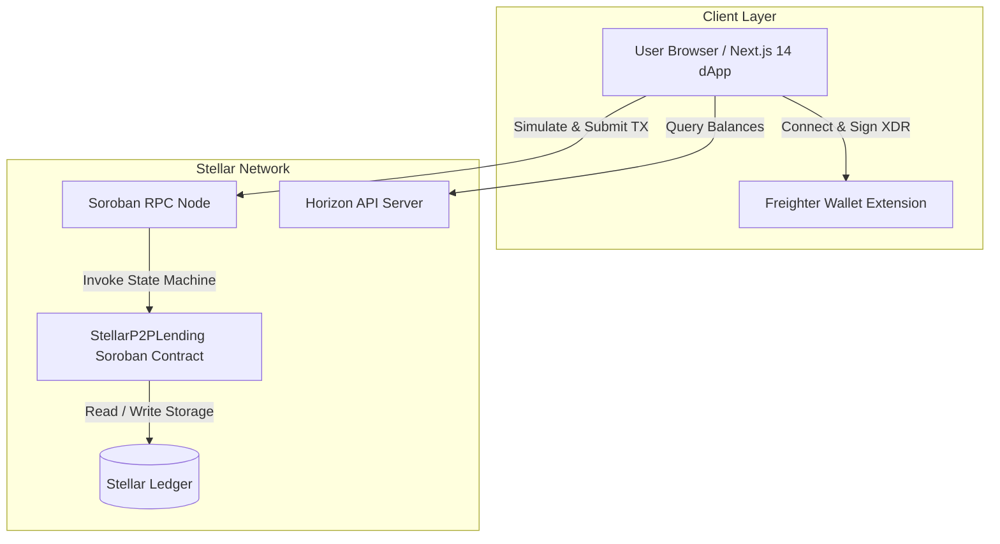
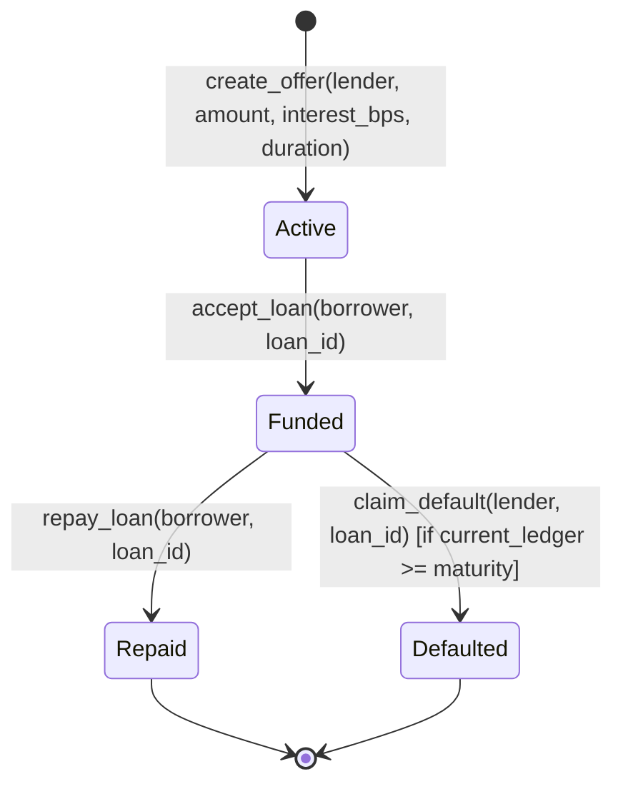

# 🏛️ StellarP2P Architecture & Technical Specifications

This document outlines the complete architectural design, data structures, state machine, and communication layers for the **StellarP2P** peer-to-peer lending protocol on the Stellar blockchain (Soroban).

---

## 1. System Architecture Overview



---

## 2. Smart Contract State Machine

Every P2P loan follows a strictly validated finite state machine implemented in Rust:



### Loan State Definitions

| State | Numeric Value | Description |
| :--- | :--- | :--- |
| `Active` | `0` | Loan offer created by lender, awaiting borrower acceptance. |
| `Funded` | `1` | Borrower accepted loan; funds disbursed, repayment timer active. |
| `Repaid` | `2` | Borrower repaid full principal plus agreed interest. |
| `Defaulted` | `3` | Maturity period expired without repayment; lender claimed default. |

---

## 3. Data Structures & Storage Layout

### Storage Architecture
- **Instance Storage**: Stores global counters (`LoanCount`) and protocol administrators (`Admin`).
- **Persistent Storage**: Stores individual loan details (`Loan(u64)`) and user-to-loan index mappings (`UserLoans(Address)`).

```rust
#[contracttype]
#[derive(Clone, Debug)]
pub struct LoanOffer {
    pub id: u64,
    pub lender: Address,
    pub borrower: Option<Address>,
    pub amount: i128,              // Principal in stroops (1 XLM = 10^7 stroops)
    pub interest_bps: u32,         // Basis points (500 = 5.00%)
    pub duration_ledgers: u32,     // Loan duration in Stellar ledger sequence numbers
    pub start_ledger: u32,         // Sequence number at time of borrower acceptance
    pub state: LoanState,
}
```

---

## 4. Repayment & Interest Calculation

Interest is calculated deterministically on-chain without floating point precision risks:

$$\text{Interest} = \frac{\text{Principal} \times \text{Interest BPS}}{10\,000}$$

$$\text{Total Repayment} = \text{Principal} + \text{Interest}$$

### Example:
- **Principal:** $1,000\text{ XLM}$ ($10,000,000,000\text{ stroops}$)
- **Interest:** $500\text{ BPS}$ ($5.00\%$)
- **Calculation:** $10,000,000,000 \times 500 / 10,000 = 500,000,000\text{ stroops}$ ($50\text{ XLM}$)
- **Total Due:** $1,050\text{ XLM}$ ($10,500,000,000\text{ stroops}$)

---

## 5. Frontend & Contract Bridge Layer

The dApp communicates with the Soroban smart contract via `frontend/lib/contract.js`:

1. **Transaction Simulation**: Simulates contract execution against current testnet state using Soroban RPC.
2. **Freighter Authorization**: Converts transaction to XDR and requests user signature via Freighter wallet.
3. **Submission & Polling**: Submits signed transaction to Stellar Testnet and polls until consensus finality is reached (~5 seconds).
