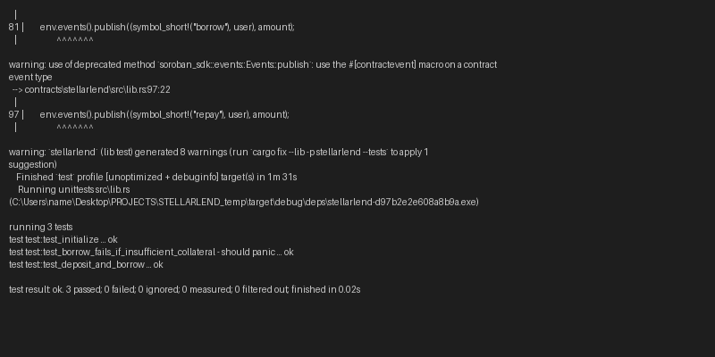

# 🚀 Stellar Soroban P2P Lending Smart Contract
[](https://github.com/ashishh-tech/Stellar-Peer-to-Peer-Lending/actions/workflows/ci.yml)

## 📌 Project Description

This project is a decentralized Peer-to-Peer (P2P) lending platform built on the Stellar blockchain using Soroban smart contracts. It allows users to lend and borrow funds directly without intermediaries, ensuring transparency, security, and low transaction costs.

---

## ⚙️ What it does

The smart contract enables:

* Lenders to create loan offers
* Borrowers to accept loans
* Borrowers to repay loans
* Public access to loan details

All operations are executed on-chain using Soroban smart contracts, ensuring trustless transactions.

---

## ✨ Features

* 🔗 Fully decentralized lending system
* 👛 Wallet-based authentication (no login required)
* 💸 Loan creation and acceptance
* 🔄 Loan repayment tracking
* 📊 Transparent loan data stored on-chain
* ⚡ Fast and low-cost transactions using Stellar

---

## 🛠️ Tech Stack

* Stellar Blockchain
* Soroban Smart Contracts (Rust)
* Stellar CLI
* Freighter Wallet

---

## 🚀 How to Run Locally

1. Install Stellar CLI
2. Clone this repository
3. Build the contract:

   ```
   cargo build --target wasm32-unknown-unknown --release
   ```
4. Deploy using Stellar CLI

---

## 🌐 Deployed Smart Contract (Testnet)

### 🔗 **Contract Explorer (Stellar Expert)**
https://stellar.expert/explorer/testnet/contract/CDSYUIDUTWYYPT37MH274AGVGVUR6H3IVUQGWUWYX6A6B3U55I37TJKJ
### **Contract ID**
```
CDSYUIDUTWYYPT37MH274AGVGVUR6H3IVUQGWUWYX6A6B3U55I37TJKJ
```

---

## 🎬 Live Demo & Video

*   **Live Application**: [STELLARLEND Live on Netlify](https://stellarlendmastery-demo.netlify.app)
*   **Demo Video**: [YOUR_YOUTUBE_LINK_HERE](https://youtube.com)

---

## 📸 Project Showcase

### **1. Premium Lending Dashboard**
The frontend features a high-end glassmorphism design with animated background orbs, real-time Stellar balance fetching, and a dynamic portfolio health tracker.


### **2. On-Chain Contract Verification**
Proof of deployment on the Stellar Testnet as seen on Stellar Expert.


### **3. Smart Contract Test Verification**
Proof of passing local unit tests for the Soroban smart contract operations.



### **4. Mobile Responsive UI**
The dashboard is fully responsive, ensuring a seamless lending and borrowing experience on mobile devices.

<p align="center">
  
</p>


---

## 🎨 UI/UX Features (Frontend)

*   **Next.js 14 App Router** for speed and SEO.
*   **Glassmorphism Aesthetic** with `backdrop-blur` and glowing ambient orbs.
*   **Freighter Wallet Integration** for secure transaction signing.
*   **Real-time Data** fetching via Horizon Testnet API.
*   **Responsive Health Bar** calculating borrow limits on-the-fly.

---

## 📁 Project Structure

```text
.
├── frontend/             # Next.js 14 Web Application
├── contracts/            # Soroban Smart Contracts (Rust)
├── screenshots/          # Project visual showcases
├── Cargo.toml            # Workspace configuration
└── README.md             # Project documentation
```

---

## 🔌 Frontend-Contract Integration

The frontend communicates with the deployed Soroban smart contract through a dedicated integration layer in `frontend/lib/`. These files are the bridge between the Next.js UI and the on-chain contract:

| File | Purpose |
|------|---------|
| `frontend/lib/contract.js` | **Core integration** — imports `stellar-sdk` (`@stellar/stellar-sdk`) and exposes `initialize()`, `deposit()`, `withdraw()`, `borrow()`, `repay()`, and `getAccountData()`. Each function builds a Soroban transaction, simulates it, signs via Freighter wallet, submits, and polls for on-chain confirmation. Function names and parameters match the Rust contract in `contracts/stellarlend/src/lib.rs` exactly. |
| `frontend/lib/stellar.config.js` | Network configuration — reads `CONTRACT_ID`, Soroban RPC URL, Horizon URL, and network passphrase from environment variables (`.env.local`). |
| `frontend/lib/freighter.js` | Wallet connection helper — wraps the `@stellar/freighter-api` to detect and connect to the Freighter browser wallet. |

### How the UI uses these files

* **`Dashboard.jsx`** calls `getAccountData(userAddress)` from `contract.js` to read the user's supplied/borrowed position from the contract (read-only simulation, no signing needed).
* **`AssetModal.jsx`** calls `deposit()`, `withdraw()`, `borrow()`, or `repay()` from `contract.js` when the user confirms a Supply, Withdraw, Borrow, or Repay action. Each call triggers a Freighter signing popup and submits the signed transaction to the Stellar testnet.

---

## 🛠️ How to Run Locally

### **Frontend**
1. Enter the directory: `cd frontend`
2. Install dependencies: `npm install`
3. Set up environment variables:
   - Copy `.env.example` to `.env.local`
   - `cp .env.example .env.local`
4. Run development server: `npm run dev`
5. Open [http://localhost:3000](http://localhost:3000) in your browser.

### **Smart Contract**
1. Build the contract: `cargo build --target wasm32-unknown-unknown --release`
2. Deploy using Stellar CLI.

---

## 👨‍💻 Author

**Ashish Chaurasia**  
[GitHub Profile](https://github.com/ashishh-tech)

---

## 📜 License

MIT License

- New Soroban contracts can be put in `contracts`, each in their own directory.
- Contracts should have their own `Cargo.toml` files that rely on the top-level `Cargo.toml` workspace for their dependencies.
- Frontend libraries can be added to the top-level directory as well.

---

## 📌 Future Improvements

* Interest rate mechanism
* Collateral support
* Default penalties
* Multi-asset lending support
