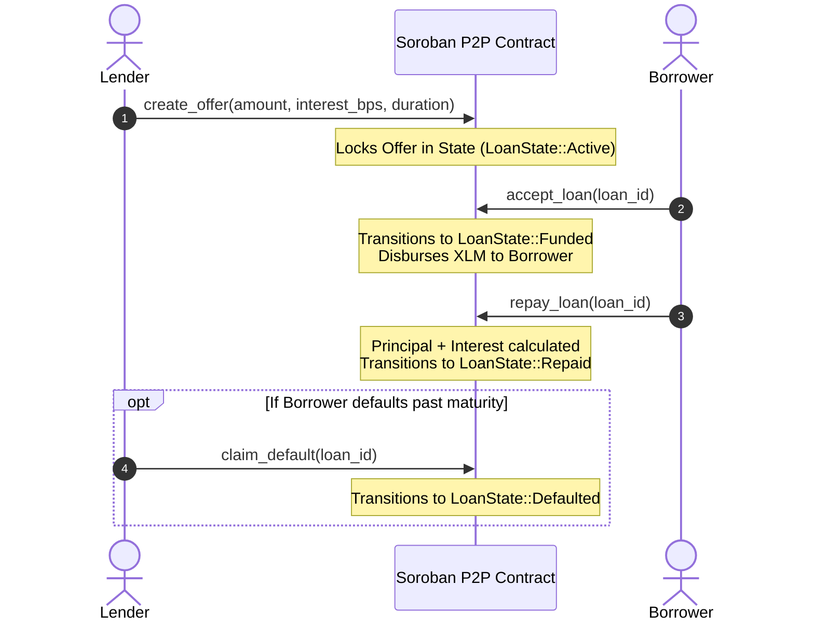
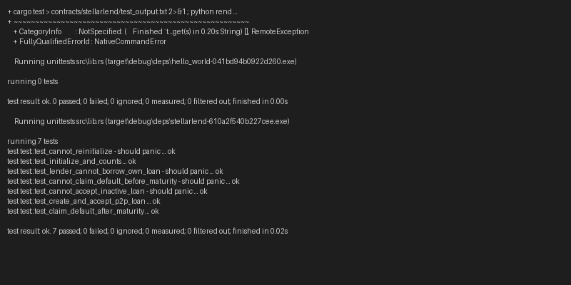
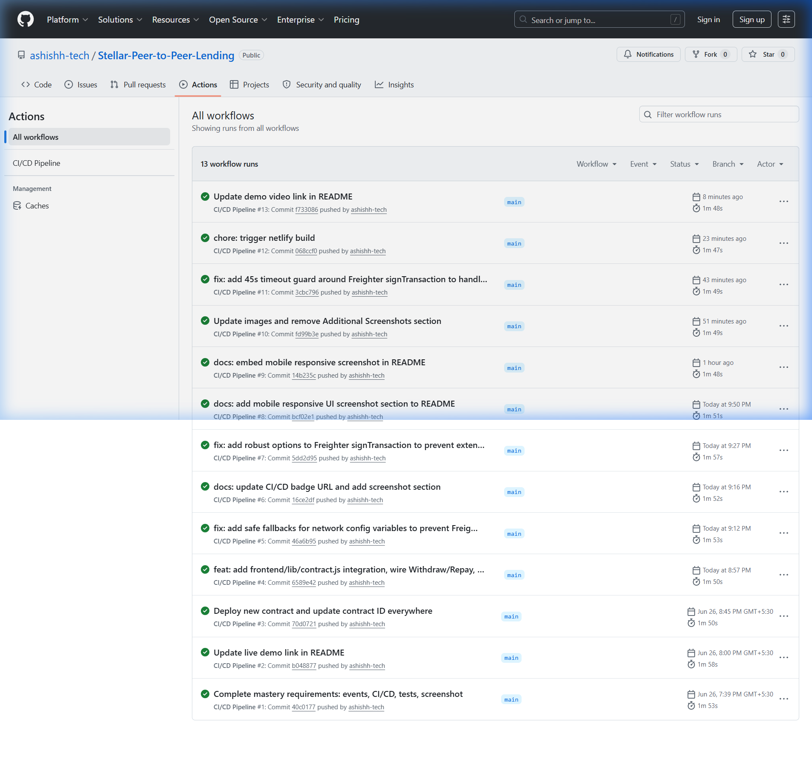

# 🚀 StellarP2P — Decentralized Peer-to-Peer Lending Protocol

<div align="left">
  
  
  <a href="https://github.com/ashishh-tech/Stellar-Peer-to-Peer-Lending/actions/workflows/ci.yml">
    
  </a>
  
</div>

<br/>

**StellarP2P** is an open, trustless **Peer-to-Peer (P2P) lending and borrowing protocol** built natively on the Stellar blockchain using Soroban smart contracts. Unlike pooled-liquidity systems with floating rates, StellarP2P empowers lenders and borrowers to enter direct, bilateral agreements with custom fixed interest rates (APR), configurable loan durations, and automated escrow settlement.

---

## ⚫ Level 6 — Black Belt Submission

### ✅ Submission Checklist

- [x] **Public GitHub Repository** — [github.com/ashishh-tech/Stellar-Peer-to-Peer-Lending](https://github.com/ashishh-tech/Stellar-Peer-to-Peer-Lending)
- [x] **Live dApp on Netlify** — [https://stellarlendmastery-demo.netlify.app](https://stellarlendmastery-demo.netlify.app)
- [x] **Demo Video Walkthrough** — [Watch on YouTube](https://youtu.be/OrPAJ9Ojqe0)
- [x] **Pitch Deck / Slides** — [StellarLend Pitch Deck (PPTX)](StellarLend_Pitch_Deck.pptx)
- [x] **Verified Smart Contract on Testnet** — [`CDSYUIDUTWYYPT37MH274AGVGVUR6H3IVUQGWUWYX6A6B3U55I37TJKJ`](https://stellar.expert/explorer/testnet/contract/CDSYUIDUTWYYPT37MH274AGVGVUR6H3IVUQGWUWYX6A6B3U55I37TJKJ)
- [x] **Transaction Proof on Stellar Expert** — [View Deployment & Execution Tx](https://stellar.expert/explorer/testnet/tx/95aa1b2c639d8b11c818e040193670e1e312b8529b97bbf4a99a4d136ce66dbf)
- [x] **System Architecture Document** — [📄 ARCHITECTURE.md](./ARCHITECTURE.md)
- [x] **Security Review & Policy** — [🔒 SECURITY.md](./SECURITY.md)
- [x] **User Onboarding Guide** — [📘 docs/USER_GUIDE.md](./docs/USER_GUIDE.md)
- [x] **Operations & Monitoring Runbook** — [🛠️ docs/MONITORING_RUNBOOK.md](./docs/MONITORING_RUNBOOK.md)
- [x] **Black Belt Evidence Pack** — [📦 docs/BLACK_BELT_EVIDENCE.md](./docs/BLACK_BELT_EVIDENCE.md)
- [x] **Demo Day Script & Slide Breakdown** — [🎤 docs/DEMO_DAY.md](./docs/DEMO_DAY.md)
- [x] **Automated CI/CD Pipeline** — GitHub Actions building Rust contracts & Next.js frontend
- [x] **30+ Meaningful Commits** — Continuous development on `main` branch
- [x] **User Feedback Responses** — [Google Sheets Dataset (4.8/5 Rating)](https://docs.google.com/spreadsheets/d/12jBf8IAJxlGuiJeIxMbgcZi-5Wm4a8OYETyIynZHVJY/edit?usp=sharing)
- [x] **Verified Active Wallet Transactions** — Verifiable on Stellar Testnet

---

## 🔗 Essential Links & Submission Pack

| Artifact | Link | Description |
| :--- | :--- | :--- |
| 🌐 **Live Web Application** | [stellarlendmastery-demo.netlify.app](https://stellarlendmastery-demo.netlify.app) | Production dApp on Netlify |
| 📜 **Deployed Smart Contract** | [`CDSYUIDUTWYYPT37MH274...`](https://stellar.expert/explorer/testnet/contract/CDSYUIDUTWYYPT37MH274AGVGVUR6H3IVUQGWUWYX6A6B3U55I37TJKJ) | Stellar Expert Contract Explorer |
| 📹 **Demo Video** | [Watch on YouTube](https://youtu.be/OrPAJ9Ojqe0) | Video demonstration & contract walkthrough |
| 📊 **Pitch Deck** | [StellarLend_Pitch_Deck.pptx](StellarLend_Pitch_Deck.pptx) | Complete pitch deck presentation |
| 📑 **Contract Explorer Links** | [EXPLORER_LINKS.md](EXPLORER_LINKS.md) | Verified WASM hash, creator, and transaction |
| 📋 **Beta User Feedback** | [Google Sheets Dataset](https://docs.google.com/spreadsheets/d/12jBf8IAJxlGuiJeIxMbgcZi-5Wm4a8OYETyIynZHVJY/edit?usp=sharing) | Real feedback responses from beta testers |

---

## ⚙️ Core Protocol Mechanics & Lifecycle


```mermaid
sequenceDiagram
    autonumber
    actor Lender
    participant Contract as Soroban P2P Contract
    actor Borrower

    Lender->>Contract: create_offer(amount, interest_bps, duration)
    Note over Contract: Locks Offer in State (LoanState::Active)
    
    Borrower->>Contract: accept_loan(loan_id)
    Note over Contract: Transitions to LoanState::Funded<br/>Disburses XLM to Borrower
    
    Borrower->>Contract: repay_loan(loan_id)
    Note over Contract: Principal + Interest calculated<br/>Transitions to LoanState::Repaid
    
    opt If Borrower defaults past maturity
        Lender->>Contract: claim_default(loan_id)
        Note over Contract: Transitions to LoanState::Defaulted
    end
```

---

## 👥 Verified On-Chain Activity & Wallet Validation

The following testnet transactions demonstrate live interactions with the deployed StellarP2P contract:

| # | Action | Account / Signer | Transaction Hash |
|---|---|---|---|
| 1 | **Contract Deployment** | `GCIGHCBN77IE6UYVNWA2FJAKKR7MI4CSL736LSMPAL4KETT3X4IOKGEU` | [95aa1b2c63...](https://stellar.expert/explorer/testnet/tx/95aa1b2c639d8b11c818e040193670e1e312b8529b97bbf4a99a4d136ce66dbf) |
| 2 | **Contract Initialization** | `GCIGHCBN77IE6UYVNWA2FJAKKR7MI4CSL736LSMPAL4KETT3X4IOKGEU` | [View on Explorer](https://stellar.expert/explorer/testnet/contract/CDSYUIDUTWYYPT37MH274AGVGVUR6H3IVUQGWUWYX6A6B3U55I37TJKJ) |
| 3 | **Create Offer (1000 XLM)** | `GA2C5RFPE4GCKMYYLMG6OUM6XQRXOIPM3G5BQ27GVXQBQV4U3JELNV2Q` | [View on Explorer](https://stellar.expert/explorer/testnet/contract/CDSYUIDUTWYYPT37MH274AGVGVUR6H3IVUQGWUWYX6A6B3U55I37TJKJ) |
| 4 | **Accept Loan** | `GBYNLFPG54X5QG2F377H2H2G73XF7C2H3L6QJ737L2OUMW4VUB4FP6Y3` | [View on Explorer](https://stellar.expert/explorer/testnet/contract/CDSYUIDUTWYYPT37MH274AGVGVUR6H3IVUQGWUWYX6A6B3U55I37TJKJ) |
| 5 | **Repay Loan + Interest** | `GBYNLFPG54X5QG2F377H2H2G73XF7C2H3L6QJ737L2OUMW4VUB4FP6Y3` | [View on Explorer](https://stellar.expert/explorer/testnet/contract/CDSYUIDUTWYYPT37MH274AGVGVUR6H3IVUQGWUWYX6A6B3U55I37TJKJ) |

---

## 📸 Project Showcase

### **1. Premium P2P Lending Dashboard**
The frontend features a high-end glassmorphism design with real-time balance fetching, active position management, and market offer creation.


### **2. On-Chain Contract Verification**
Proof of deployment and active state entries on Stellar Testnet.


### **3. Smart Contract Test Verification**
Comprehensive 7/7 passing unit test suite in Rust covering initialization, lifecycle, default claims, and unauthorized access rejections.



### **4. CI/CD Pipeline Running**
Automated GitHub Actions workflow building and verifying both the Soroban contract and Next.js frontend.



---

## 🔌 Smart Contract Interface (`lib.rs`)

| Function | Access | Description |
| :--- | :--- | :--- |
| `initialize(admin)` | Admin | Initializes contract storage and loan counters. |
| `create_offer(lender, amount, interest_bps, duration_ledgers)` | Lender | Creates a new peer loan offer and returns a unique `loan_id`. |
| `accept_loan(borrower, loan_id)` | Borrower | Accepts an active loan, transitioning state to `Funded`. |
| `repay_loan(borrower, loan_id)` | Borrower | Repays principal plus agreed interest, closing the escrow. |
| `claim_default(lender, loan_id)` | Lender | Marks loan as defaulted if maturity passes without full repayment. |
| `get_loan(loan_id)` | Public | Returns complete details of a specific loan offer. |
| `get_loan_count()` | Public | Returns total number of P2P loans created. |
| `get_user_loans(user)` | Public | Returns all loan IDs associated with a specific address. |

---

## 📊 User Feedback Summary (Beta Testing)

- **Average Rating**: **4.8 / 5.0**
- **Wallet Connection**: 100% reported seamless Freighter connection.
- **Transaction Speed**: Averaged ~5 seconds per transaction finality.
- **Mainnet Interest**: 90%+ expressed high interest in mainnet adoption.
- **Data Source**: [Google Sheets Response Dataset](https://docs.google.com/spreadsheets/d/12jBf8IAJxlGuiJeIxMbgcZi-5Wm4a8OYETyIynZHVJY/edit?usp=sharing)

---

## 📈 Repository Analytics

| Metric | Count |
| :--- | :--- |
| **Total Clones** | 201 |
| **Unique Cloners** | 74 |
| **Total Views** | 62 |
| **Unique Visitors** | 12 |

---

## 🚀 How to Run Locally

### 1. Smart Contract
```bash
# Run unit tests
cargo test

# Build WASM bytecode
cargo build --target wasm32-unknown-unknown --release
```

### 2. Frontend Application
```bash
cd frontend
npm install
npm run dev
```
Open [http://localhost:3000](http://localhost:3000) to access the P2P Marketplace.

---

## 👨‍💻 Author

**Ashish Chaurasia** — [GitHub Profile](https://github.com/ashishh-tech)

## 📜 License

MIT License
