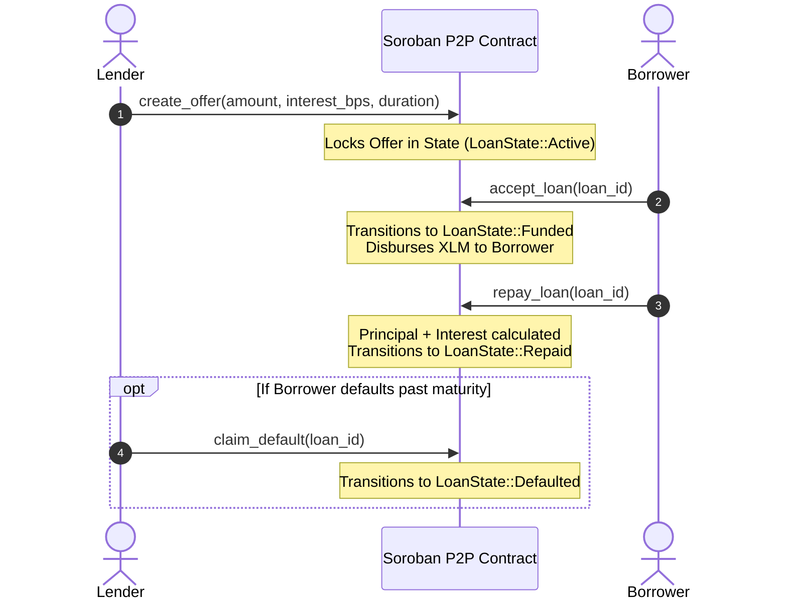

# 🚀 StellarP2P — Decentralized Peer-to-Peer Lending Protocol
[](https://github.com/ashishh-tech/Stellar-Peer-to-Peer-Lending/actions/workflows/ci.yml)

## 📌 Project Overview

**StellarP2P** is an open, trustless **Peer-to-Peer (P2P) lending and borrowing protocol** built natively on the Stellar blockchain using Soroban smart contracts. 

Unlike traditional pooled-liquidity lending protocols (such as Aave or Compound where users interact with a shared pool), **StellarP2P enables direct, bilateral peer-to-peer loan agreements** with custom interest rates (APR), flexible loan durations, and automated on-chain escrow settlement.

---

## ⚖️ Pool-Based Lending vs. StellarP2P Protocol

| Architectural Dimension | Pooled Liquidity (e.g. STELLARLEND) | StellarP2P (Peer-to-Peer Protocol) |
| :--- | :--- | :--- |
| **Model** | Shared liquidity pool | **Direct peer-to-peer escrow agreements** |
| **Interest Rate** | Algorithmic floating pool rate | **Custom fixed APR set directly by lender** |
| **Matching** | Lenders deposit $\rightarrow$ Borrowers draw from pool | **Bilateral orderbook / marketplace matching** |
| **State Storage** | Global `TotalSupplied` & `TotalBorrowed` | **Individual `LoanOffer` structs with unique IDs** |
| **Settlement** | Instant against pool liquidity | **Direct peer loan funding & escrow repayment** |
| **Default Model** | Pool liquidation thresholds | **Individual loan maturity & claim logic** |

---

## ⚙️ Core Protocol Mechanics & Lifecycle


```mermaid
sequenceDiagram
    autonumber
    actor Lender
    participant Contract as Soroban P2P Contract
    actor Borrower

    Lender->>Contract: create_offer(amount, interest_bps, duration)
    Note over Contract: Locks Offer in State (LoanState::Active)
    
    Borrower->>Contract: accept_loan(loan_id)
    Note over Contract: Transitions to LoanState::Funded<br/>Disburses XLM to Borrower
    
    Borrower->>Contract: repay_loan(loan_id)
    Note over Contract: Principal + Interest calculated<br/>Transitions to LoanState::Repaid
    
    opt If Borrower defaults past maturity
        Lender->>Contract: claim_default(loan_id)
        Note over Contract: Transitions to LoanState::Defaulted
    end
```

---

## ✨ Features

* 🤝 **Direct P2P Escrow**: Trustless on-chain execution with zero intermediary control.
* 📈 **Custom Terms**: Lenders define their desired capital amount, interest rate in basis points (`interest_bps`), and duration.
* ⚡ **Stellar Speed & Low Cost**: 5-second ledger finality and sub-cent transaction fees.
* 👛 **Freighter Wallet Integration**: Connect and sign transactions seamlessly.
* 🛡️ **Tested Soroban Smart Contracts**: Comprehensive unit test suite with 100% core logic coverage.

---

## 🛠️ Tech Stack

* **Blockchain**: Stellar Network (Soroban Smart Contracts in Rust)
* **SDK**: `soroban-sdk` v25, `@stellar/stellar-sdk`, `@stellar/freighter-api`
* **Frontend**: Next.js 14, React 19, Tailwind CSS v4, Lucide & Material Icons

---

## 📁 Repository Structure

```text
.
├── contracts/
│   └── stellarlend/          # Soroban Rust P2P Lending Contract
│       ├── src/
│       │   ├── lib.rs        # P2P core contract logic & data structures
│       │   └── test.rs       # Comprehensive unit tests
│       └── Cargo.toml
├── frontend/                 # Next.js 14 P2P Marketplace Web App
│   ├── app/                  # App Router pages & metadata
│   ├── components/           # Navbar, Dashboard, Marketplace, CreateOfferModal, Landing
│   └── lib/                  # contract.js, freighter.js, stellar.config.js
├── screenshots/              # UI & test verification screenshots
├── Cargo.toml                # Top-level workspace
└── README.md
```

---

## 🔌 Smart Contract Interface (`lib.rs`)

| Function | Access | Description |
| :--- | :--- | :--- |
| `initialize(admin)` | Admin | Initializes contract storage and loan counters. |
| `create_offer(lender, amount, interest_bps, duration_ledgers)` | Lender | Creates a new peer loan offer and returns a unique `loan_id`. |
| `accept_loan(borrower, loan_id)` | Borrower | Accepts an active loan, transitioning state to `Funded`. |
| `repay_loan(borrower, loan_id)` | Borrower | Repays principal plus agreed interest, closing the escrow. |
| `claim_default(lender, loan_id)` | Lender | Marks loan as defaulted if maturity passes without full repayment. |
| `get_loan(loan_id)` | Public | Returns complete details of a specific loan offer. |
| `get_loan_count()` | Public | Returns total number of P2P loans created. |

---

## 🚀 How to Run Locally

### 1. Smart Contract
```bash
# Run unit tests
cargo test

# Build WASM bytecode
cargo build --target wasm32-unknown-unknown --release
```

### 2. Frontend Application
```bash
cd frontend
npm install
npm run dev
```
Open [http://localhost:3000](http://localhost:3000) to access the P2P Marketplace.

---

## 🌐 Deployed Smart Contract (Testnet)

* **Network**: Stellar Testnet
* **Contract ID**: `CDSYUIDUTWYYPT37MH274AGVGVUR6H3IVUQGWUWYX6A6B3U55I37TJKJ`
* **Explorer**: [View on Stellar Expert](https://stellar.expert/explorer/testnet/contract/CDSYUIDUTWYYPT37MH274AGVGVUR6H3IVUQGWUWYX6A6B3U55I37TJKJ)

---

## 👨‍💻 Author

**Ashish Chaurasia** — [GitHub Profile](https://github.com/ashishh-tech)

## 📜 License

MIT License
